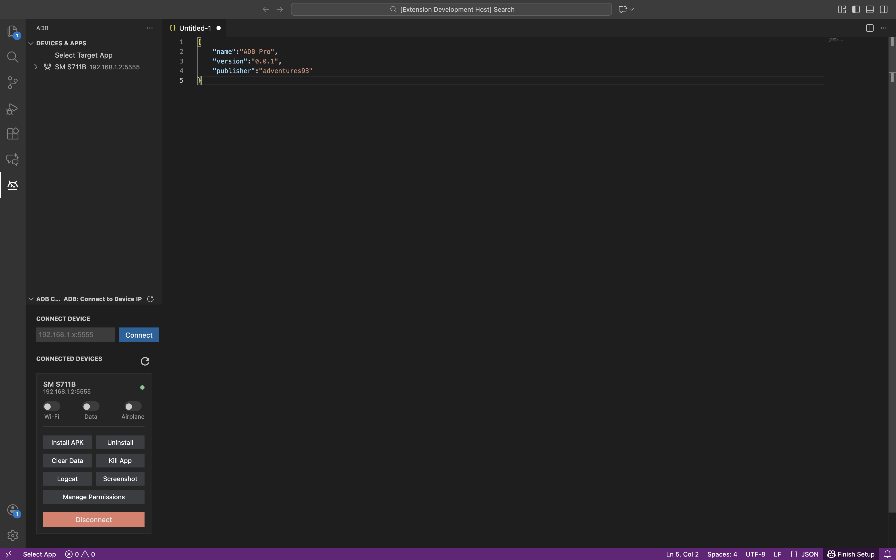
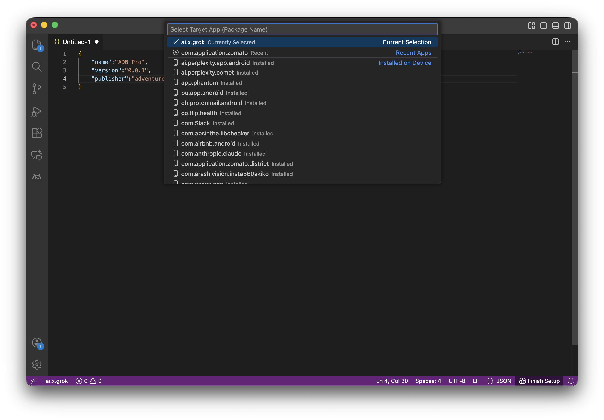
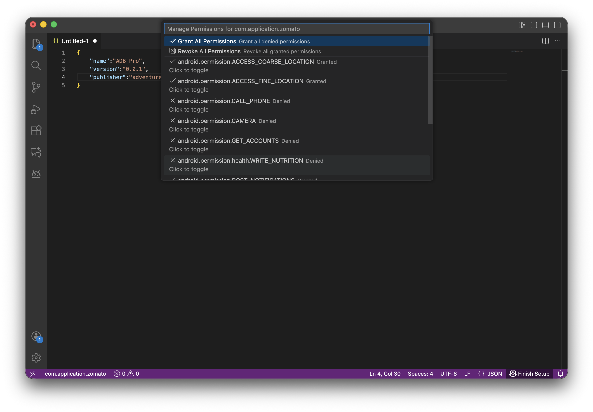
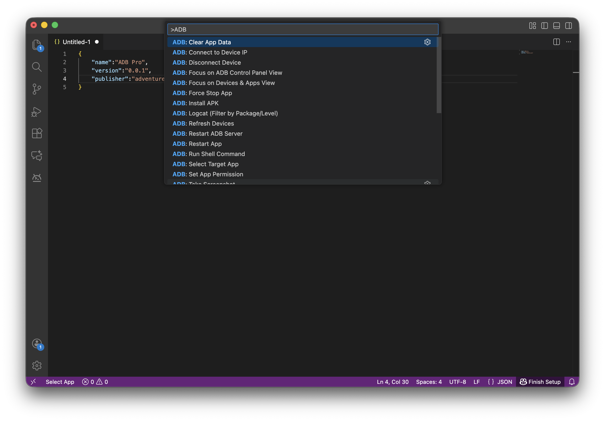

# ADB Pro for VS Code

[](https://opensource.org/licenses/MIT)
[](https://marketplace.visualstudio.com/items?itemName=adventures92.adb-pro)
[](https://marketplace.visualstudio.com/items?itemName=adventures92.adb-pro)

**ADB Pro** is a powerful Visual Studio Code extension that integrates the Android Debug Bridge (ADB) directly into your editor. It provides a user-friendly, native-looking sidebar for managing connected Android devices, installing apps, debugging, and more.

## Features

### 📱 Device Management Sidebar


*   **Native UI:** A clean, VS Code-native Webview interface.
*   **Device List:** View all connected devices with their status (device, offline, unauthorized).
*   **One-Click Actions:** Perform common tasks directly from the device card.
*   **Smart Toggles:** Control Wi-Fi, Mobile Data, and Airplane Mode with instant toggle switches.

### 🛠️ Device Actions
*   **Connect/Disconnect:** Easily connect to devices over IP and disconnect them.
*   **Install APK:** Install `.apk` files directly from your workspace.
*   **Uninstall App:** Remove applications by package name.
*   **Clear App Data:** Reset an application's data without uninstalling.
*   **Force Stop:** Kill a running application process.
*   **Permissions:** Grant or revoke application permissions.
*   **Screenshots:** Capture device screenshots and save them locally.

#### App Selection


#### Permission Management


### 🔍 Advanced Debugging
*   **Logcat Filtering:**
    *   **By Package:** Filter logs to show only those from a specific application.
    *   **By Level:** Filter logs by severity (Verbose, Debug, Info, Warn, Error, Fatal).
    *   **PID Resolution:** Automatically resolves the Process ID (PID) for a given package name.
*   **Shell Access:** Run custom shell commands on the device.

## Usage

### Sidebar Interface
1.  Click the **ADB** icon in the Activity Bar.
2.  The sidebar will show all connected devices.
3.  Use the **Toggle Switches** to control network settings.
4.  Click the **Action Buttons** (Trash, Stop, etc.) to perform specific actions.

### Command Palette


All features are also available via the Command Palette (`Cmd+Shift+P` or `Ctrl+Shift+P`). Type `ADB:` to see available commands:

*   `ADB: Connect to Device IP`
*   `ADB: Disconnect Device`
*   `ADB: Install APK`
*   `ADB: Uninstall App`
*   `ADB: Clear App Data`
*   `ADB: Force Stop App`
*   `ADB: Toggle Wi-Fi` (Interactive or Direct)
*   `ADB: Toggle Mobile Data` (Interactive or Direct)
*   `ADB: Toggle Airplane Mode` (Interactive or Direct)
*   `ADB: Logcat` (With Filtering)
*   `ADB: Take Screenshot`
*   `ADB: Run Shell Command`

## Configuration

You can configure the path to your ADB executable if it's not in your system PATH.

1.  Open **Settings** (`Cmd+,` or `Ctrl+,`).
2.  Search for `adb.path`.
3.  Enter the absolute path to your `adb` executable.

```json
{
  "adb.path": "/Users/username/Library/Android/sdk/platform-tools/adb"
}
```

## Requirements

*   **ADB:** The Android Debug Bridge command-line tool must be installed.
*   **USB Debugging:** Must be enabled on your Android device.

## Troubleshooting

*   **Device Not Showing:** Ensure USB debugging is enabled and the device is authorized. Try running `adb devices` in your terminal.
*   **Permission Denied:** Some actions (like toggling Mobile Data on newer Android versions) may require root access or specific permissions.
*   **Logcat Empty:** If filtering by package, ensure the app is running so its PID can be resolved.

## Contributing

We welcome contributions! Please see our [Contributing Guidelines](CONTRIBUTING.md) for details on how to get started.

For a high-level overview of the codebase, check out the [Architecture Documentation](docs/ARCHITECTURE.md).

Please note that this project is released with a [Contributor Code of Conduct](CODE_OF_CONDUCT.md). By participating in this project you agree to abide by its terms.

## License

This project is licensed under the MIT License - see the [LICENSE](LICENSE) file for details.

## Release Notes

### 0.0.1
*   Initial release with Webview sidebar, smart toggles, and Logcat filtering.
